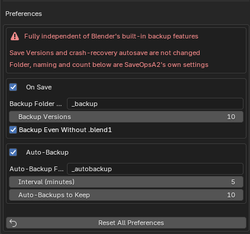

# SaveOpsA2

[日本語](README.md) | [English](README.en.md)

A save-backup extension for Blender 4.2+. The `.blend1` files Blender
creates on save are kept in a `_backup/` folder under the add-on's own
generation count, and timed auto-backup copies are written as well.

> [!IMPORTANT]
> SaveOpsA2 does not touch Blender's "Save Versions" or "Auto-Save".  
> On Save: moves the .blend1 created by "Save Versions" into the backup folder (even when it is 0, backups are still saved as .blendN)  
> Auto-Backup: writes its own timestamped copies to a separate folder

## Features

### On Save — .blendN backup chain

Every time you save, the `.blend1` file Blender creates next to your file is
moved into a `_backup/` subfolder and kept as `<name>.blend1` (newest) …
`<name>.blendN` (oldest) — the same naming convention as Blender's
"Save Versions", but in its own folder, so your project folder stays clean.

- The generation count is the add-on's own **Backup Versions** setting
  (default 10), independent of Blender's "Save Versions" value.
- Rotation only ever renames or deletes files that match the exact same file
  name stem. Anything else in the folder is never touched.
- When Blender's "Save Versions" is 0 and no `.blend1` is created, the file
  about to be overwritten is copied into the chain automatically.
- The whole feature can be switched off with the checkbox in the group
  header.

### Auto-Backup — timed snapshot copies

While the file has unsaved changes, a timestamped copy
(`<name>_auto_YYYYMMDD-HHMMSS.blend`) is written to an `_autobackup/`
subfolder at a configurable interval (default 5 minutes).

- The main file is never touched: save state, undo history and the
  "unsaved changes" flag all stay exactly as they are.
- Skips while a render is running and retries shortly after.
- Keeps its own generation count per file (default 10).
- A failing backup never interrupts your save.

### File menu

- **Backup Now** — write a snapshot copy immediately.
- **Open Backup Folder** / **Open Auto-Backup Folder** — open the backup
  folders in the system file browser.

## Installation

1. Download `saveopsa2-<version>.zip` from
   [Releases](https://github.com/a2d4f3s1/SaveOpsA2/releases).
2. In Blender: `Edit → Preferences → Get Extensions → ⌄ (top-right menu) →
   Install from Disk…` and pick the zip.
3. Enable **SaveOpsA2**.

Requires Blender 4.2 or newer. The UI is available in English and Japanese.

## License

GPL-3.0-or-later
