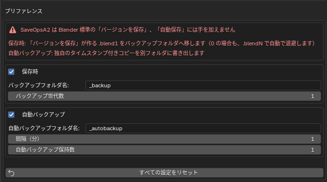

# SaveOpsA2

[日本語](README.md) | [English](README.en.md)

Blender 4.2+ 向けの保存バックアップ拡張です。保存時に Blender が作る
`.blend1` を `_backup/` フォルダへ整理して独自の世代数で保管し、
タイマーによる自動バックアップコピーも書き出します。

> [!IMPORTANT]
> SaveOpsA2 は Blender 標準の「バージョンを保存」、「自動保存」には手を加えません。
> 保存時: 「バージョンを保存」が作る .blend1 をバックアップフォルダへ移します（0 の場合も、.blendN で自動で退避します）
> 自動バックアップ: 独自のタイムスタンプ付きコピーを別フォルダに書き出します

## 機能

### 保存時バックアップ — .blendN チェーン

保存のたびに、Blender がファイルの隣に作る `.blend1` を `_backup/`
サブフォルダへ移動し、`<名前>.blend1`（最新）〜 `<名前>.blendN`（最古）として
保持します。標準の「バージョンを保存」と同じ命名規則を別フォルダで運用するため、
プロジェクトフォルダが散らかりません。

- 世代数はアドオン独自の **Backup Versions** 設定（既定 10）。Blender 本体の
  「バージョンを保存」とは無関係です
- ローテーションが改名・削除するのは**同じファイル名 stem に完全一致する
  ファイルだけ**。フォルダ内の他のファイルには絶対に触れません
- 「バージョンを保存」が 0 の環境では、上書き前のファイルを自動でコピーして
  同じチェーンに退避します
- グループヘッダのチェックボックスで機能ごと無効化できます

### 自動バックアップ — 定期スナップショット

未保存の変更がある間、タイムスタンプ付きコピー
（`<名前>_auto_YYYYMMDD-HHMMSS.blend`）を `_autobackup/` サブフォルダへ
設定間隔（既定 5 分）で書き出します。

- 本体ファイルには一切触れません。保存状態・undo 履歴・「未保存」フラグは
  そのまま維持されます
- レンダリング中はスキップし、少し後に再試行します
- ファイルごとに独自の保持数（既定 10）でローテーションします
- バックアップの失敗がユーザーの保存を妨げることはありません

### File メニュー

- **今すぐバックアップ** — スナップショットコピーを即時書き出し
- **バックアップフォルダを開く** / **自動バックアップフォルダを開く** —
  各フォルダをシステムのファイルブラウザで開きます

## インストール

1. [Releases](https://github.com/a2d4f3s1/SaveOpsA2/releases) から
   `saveopsa2-<version>.zip` をダウンロード
2. Blender の `編集 → プリファレンス → エクステンション入手 → 右上の ⌄ →
   ディスクからインストール…` で zip を選択
3. **SaveOpsA2** を有効化

Blender 4.2 以降が必要です。UI は英語と日本語に対応しています。

## ライセンス

GPL-3.0-or-later
